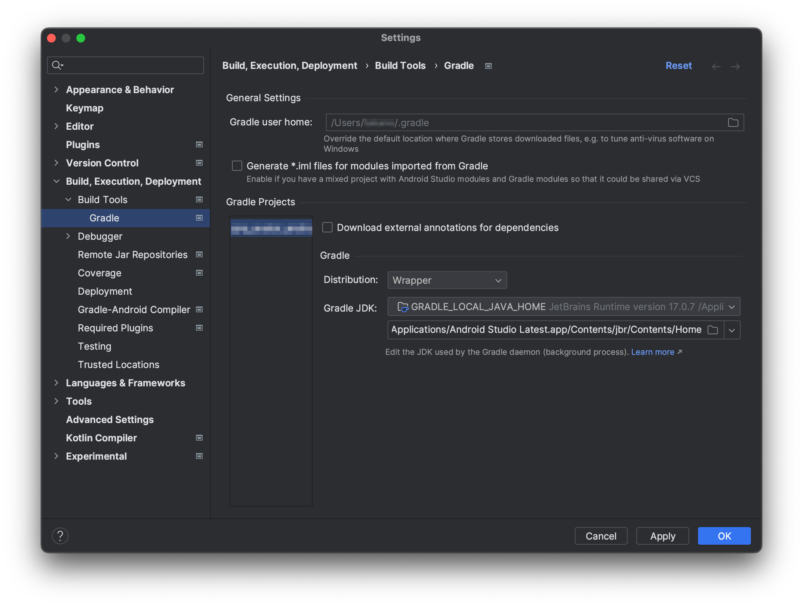

# Javaのパスを通す

## JDKのパス

Android StudioにバンドルされているJavaを使用する。



## 環境設定

fishを使っているのでconfig.fishに以下追加する。

```
set -x JAVA_HOME "/Applications/Android Studio Latest.app/Contents/jbr/Contents/Home"
```
